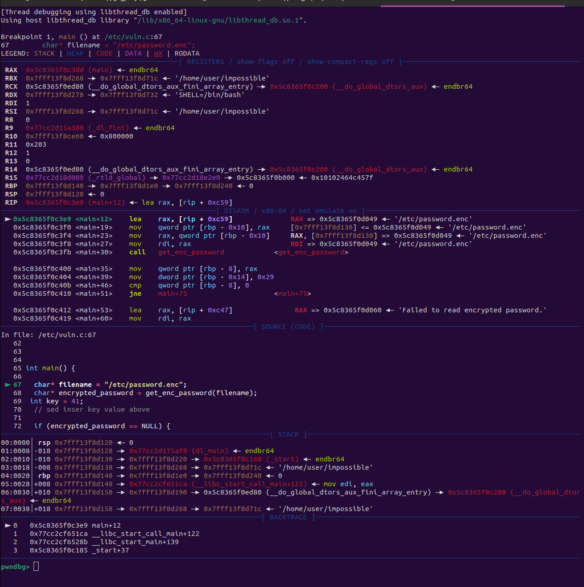
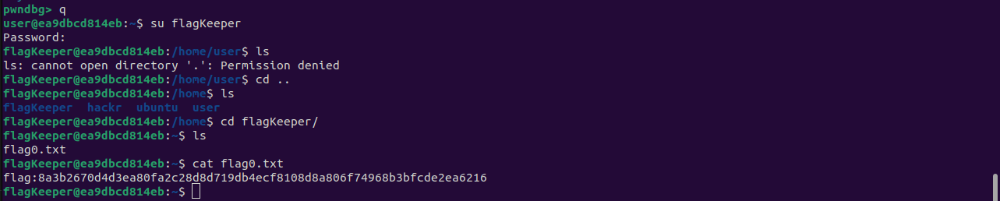

# Getting Started with GDB


## Introduction:


GDB is a powerful debugging tool for programs written in C, C++, and other languages. It helps developers find bugs. We can use this as attackers or defenders to find information in a binary and our hunt for vulnerabilities such as overflows.


> If you have not completed the `r2` walkthrough level please complete that level and then come back to this one.


## Intro:


The goal for this challenge is to use GDB to find the correct password for the `flagKeeper` user which is accessed somehow by the provided binary. The source code has also been provided for ease of learning. In future challenges this will not be given.


First thing first let's take a look at our binary using `r2` just to get a grip on what is going on.


`r2 impossible` > `aaa` > `s main` > `pdf`:


Based on this we can see that this file is reading in an encrypted password and decrypting it. While the string is never directly printed we can fish it out using GDB.


## Using GDB:


Vanilla GDB is very tedious and difficult to use for reversing and exploitation. Groups have created various plugins to make GDB look nicer and make using it more efficient.


Within pen platoon multiple GDB plugins have been installed `pwn-dbg`,`peda` and `gef`.


You can run gdb by typing `gdb-[name of plugin]`


> This guide uses pwndbg, some of the info provided is unique to that plugin.


First we must load our file to be used with GDB.


`file [name of binary]`


Now we should be able to run the file.


`r` or `run`


We can see that the program runs successfully, however this is not helpful for us as we want to debug and step through this program.


We can do this using a `breakpoint`. A `breakpoint` is a crucial part of debugging and essentially stops execution of the program at a given section.


To begin debugging our program lets set a breakpoint at main.


`b main` or `breakpoint main`


> Due to having access to debug symbols and the source code for this file we can actually see where the file is located and the source code is being read from.


Next we can start the program and begin debugging.


`start`





Ok now we have a lot to look at... Let's dive in.


### Lay of the land (understanding GDB output):


Let's start at the top of the GDB window.


Above we can see a view of all of the registers. If you are unfamiliar with what a register is you can think of it as a little section of the CPU that stores data. Some of these registers do special things such as the stack and base pointers.


Some types of registers:


*   General-purpose:
   * These registers are used to store temporary data for various data operations.
*   Instruction pointer(program counter):
   * Contains the address to the next instruction to be executed. It also serves as a counter for the number of instructions.
*   Instruction Register:
   * Holds the address of the instruction that is being executed. Once the address from the IP/PC is stored in IR the CPU executes it.
*   Stack and frame pointers:
   * The stack pointer points to the top of the stack. Frame pointer always points to a fixed position in the stack.


> If you want more information on assembly and registers I recommend checking this link out. [Basics of Assembly for Makers and Hackers](https://saadams.github.io/posts/mal-asm/)


Moving onto the disasm window.


The above imgs/image shows the disassembly window which shows the disassembly of the program. If you are new to looking at assembly I would recommend the above guide once again.


The source code window


This window just simply shows the source code of the file.


> This will not be visible in almost all "real" exploiting and reversing scenarios.


The stack and backtrace window


This window shows the current stack segment and is useful for looking for data on the stack. This will also contain the stack pointer and base pointer.


The backtrace window essentially shows the steps in which the program took to get where it is.


## Debugging


Enough reading, let's start debugging.


With our breakpoint at main and our program started we can begin to step through the program.


There are various ways to step through a program. Some of main commands are as follows:


#### PEDA
##### Basic Stepping Commands


| Command     | Description                                           |
|-------------|-------------------------------------------------------|
| `step`      | Step into the next instruction (enters functions)     |
| `next`      | Step over the next instruction (does not enter funcs) |
| `finish`    | Continue until the current function returns           |
| `until`     | Continue execution until a specific line or address   |
| `stepi`     | Step through the next instruction   |
| `nexti`     | Step over the next instruction       |


---


#### PWNDBG (PWN Debugger)


###### Basic Stepping Commands
| Command     | Description                                           |
|-------------|-------------------------------------------------------|
| `si`        | Step into the next instruction                      |
| `ni`        | Step over the next instruction                      |
| `finish`    | Continue until the current function returns           |
| `xuntil <addr or func>` | Continue execution until a specific line or address   |
| `c`         | Continue execution until the next breakpoint          |
| `next`      | Goes to next (source) line                         |
| `nextcall`  | Continue to next call instruction                   |
| `nextjmp`   | Continue to next jump instruction                    |
| `nextret`   | Continue to next return-like instruction             |
| `stepret`   | Step until a ret instruction is found                |


> <https://pwndbg.re/CheatSheet.pdf>


Let's start moving through the program using `next`.


type: `next` or `n` and we will move forward in the execution by one "source" line.


Above we can see easily in the source code window that we have moved from line `67` to line `68`. We can also see in the disasm window we are now at `<main+23>` from `<main+12>`.


Looking at the disassembly we can see the following:


```
// Set RAX to 0x5613b6eda049
0x61caeeaa23e9 <main+12>    lea    rax, [rip + 0xc59]              RAX => 0x61caeeaa3049 ◂— '/etc/password.enc'


// Store a local var based of RAX
// value stored in local = '/etc/password.enc'
  0x61caeeaa23f0 <main+19>    mov    qword ptr [rbp - 0x10], rax     [0x7ffdcd907790] <= 0x61caeeaa3049 ◂— '/etc/password.enc'


// Move the local var into RAX again.
// This will be used in the next function call to pass to RDI (which is the first arg in the call)
► 0x61caeeaa23f4 <main+23>    mov    rax, qword ptr [rbp - 0x10]     RAX, [0x7ffdcd907790] => 0x61caeeaa3049 ◂— '/etc/password.enc'


```


This assembly corresponds to this section of code:


```
char* filename = "/etc/password.enc";


//After our step we are here
char* encrypted_password = get_enc_password(filename);
```


We can see that we have a function call coming.


Lets jump to the next instruction by using `ni` or `nexti`.


Now we can see the following lines


```
// We are here:
// This will move the value in rax to rdi for use in the function call as the first arg.
► 0x61caeeaa23f8 <main+27>    mov    rdi, rax                        RDI => 0x61caeeaa3049 ◂— '/etc/password.enc'
  0x61caeeaa23fb <main+30>    call   get_enc_password            <get_enc_password>


```


Let's do `ni` one more time to get to the function call:


```
// Here we can see the value of rdi being passed as an arg.
► 0x61caeeaa23fb <main+30>    call   get_enc_password            <get_enc_password>
       rdi: 0x61caeeaa3049 ◂— '/etc/password.enc'
```


Before we continue within `pwndbg` we can use r2 to examine the dissasembly further.


Type `r2` > `aaa` > `s main` > `pdf`:


Now let's look at the `get_enc_password` func.


Type `s sym.get_enc_password` > `pdf`:


This is a pretty large function but thanks to having all the debug symbols we can really see what is going on. This is a function that is opening a file and reading data from it.


If we had no debug symbols we could figure this out by examining all the function calls in the disassembly such as `fopen`,`fseek`,`fclose` and `fread`, these are all used when reading from files.


Now we can exit `r2` back to `pwndbg` now that we know what's going on with this func.


Type `q`


After you type `q` you should see `pwndbg> ` in your terminal.


Type `context` to get all the gdb info back up.


Because we already know loosely what this function is doing from examining it in `r2` we can use `ni` yet again to step over this instruction and view the results.


Looking at the registers window we can see what looks to be a string in RAX:


This is then being stored as a local var:


```
► 0x61caeeaa2400 <main+35>    mov    qword ptr [rbp - 8], rax         [0x7ffdcd907798] <= 0x61cb121f7490 ◂— 0x4c5f4c414a5d484a ('JH]JAL_L')


```


Which lines up to this in the source code.


```
// The string returned from get_enc_password is stored in a local var.
char* encrypted_password = get_enc_password(filename);


```


Let's move forward past these two instructions which are both assigning local vars.


```
► 0x61caeeaa2400 <main+35>    mov    qword ptr [rbp - 8], rax         [0x7ffdcd907798] <= 0x61cb121f7490 ◂— 0x4c5f4c414a5d484a ('JH]JAL_L')
  0x61caeeaa2404 <main+39>    mov    dword ptr [rbp - 0x14], 0x29     [0x7ffdcd90778c] <= 0x29


```


Type `ni` twice:


We are now at line `72` in the source code or `<main+46>`.


Let's look closer at these two instructions that assign local vars.


```
 // Assign a local var to the string that was in RAX after the function call.
 0x61caeeaa2400 <main+35>    mov    qword ptr [rbp - 8], rax         [0x7ffdcd907798] <= 0x61cb121f7490 ◂— 0x4c5f4c414a5d484a ('JH]JAL_L')


 // Assign a local var to a value that is hex 0x29 (41)
  0x61caeeaa2404 <main+39>    mov    dword ptr [rbp - 0x14], 0x29     [0x7ffdcd90778c] <= 0x29


```


We can determine based on the assembly above that the string returned from `get_enc_password` and value `41` are both being stored in local vars.


However we can also use `info locals` to view the values of local variables on the stack.


Now we have an encrypted password and a key (which was foolishly hardcoded).


We now need to continue until we get to the decryption function.


We can use `ni` yet again but make sure to stop before the decryption function which we saw in r2 earlier `enc_cipher`.


Here we can see the encrypted string and the key get passed into the function.


```
  0x61caeeaa242f <main+82>     mov    esi, edx                         ESI => 0x29
  0x61caeeaa2431 <main+84>     mov    rdi, rax                         RDI => 0x61cb121f7490 ◂— 0x4c5f4c414a5d484a ('JH]JAL_L')
► 0x61caeeaa2434 <main+87>     call   enc_cipher                  <enc_cipher>
       rdi: 0x61cb121f7490 ◂— 0x4c5f4c414a5d484a ('JH]JAL_L')


```


Lets use `r2` again to examine this decryption function:


`r2` > `aaa` > `s sym.enc_cipher` > `pdf`:


This is a classic "encryption" method which some of you may or may not know just looking at this. We are going to assume that we do not know an easy way to crack this so we are going to step through it in gdb.


Back in our context window:


lets step into this function using `si`:


> Don't believe the comment that this is not a caesar cipher.


we can see that we are now in the `enc_cipher` function.


```
► 0   0x61caeeaa2249 enc_cipher
  1   0x61caeeaa2439 main+92
  2   0x7aef08cc71ca __libc_start_call_main+122
  3   0x7aef08cc728b __libc_start_main+139
  4   0x61caeeaa2185 _start+37


```


Let's continue stepping through using `si` until `<enc_cipher+15>`.


Here we can see our variables, the encrypted string, key and a new var to be used with the loop (`i`).
```
  0x61caeeaa2251 <enc_cipher+8>     mov    qword ptr [rbp - 0x18], rdi     [0x7ffdcd907758] <= 0x61cb121f7490 ◂— 0x4c5f4c414a5d484a ('JH]JAL_L')
  0x61caeeaa2255 <enc_cipher+12>    mov    dword ptr [rbp - 0x1c], esi     [0x7ffdcd907754] <= 0x29
► 0x61caeeaa2258 <enc_cipher+15>    mov    dword ptr [rbp - 4], 0          [0x7ffdcd90776c] <= 0


```


Source:
` ► 20   int i = 0;`


Lets keep going until `<enc_cipher+22>`


This is going to `jump` us into the loop.


Continue stepping until `<enc_cipher+86>`


This is checking our while loop condition, if the condition is not met it will `jump` to execute the loop code.


Continue stepping until `<enc_cipher+40>`


Here we are assigning the first byte of the string to `ecx` and the key to `esi`
```
  0x61caeeaa226e <enc_cipher+37>    movzx  ecx, byte ptr [rax]             ECX, [0x61cb121f7490] => 0x4a
► 0x61caeeaa2271 <enc_cipher+40>    mov    eax, dword ptr [rbp - 0x1c]     EAX, [0x7ffdcd907754] => 0x29
  0x61caeeaa2274 <enc_cipher+43>    mov    esi, eax                        ESI => 0x29


```


Continue stepping until `<enc_cipher+64>`


In this section of code we are performing our encryption on `ecx`(first byte of string) and `esi`(key) we are then incrementing the `i` variable.


```
  0x61caeeaa227c <enc_cipher+51>    mov    rax, qword ptr [rbp - 0x18]     RAX, [0x7ffdcd907758] => 0x61cb121f7490 ◂— 0x4c5f4c414a5d484a ('JH]JAL_L')


  0x61caeeaa2280 <enc_cipher+55>    add    rax, rdx                        RAX => 0x61cb121f7490 (0x61cb121f7490 + 0x0)


  0x61caeeaa2283 <enc_cipher+58>    xor    ecx, esi                        ECX => 99 (0x4a ^ 0x29)


  0x61caeeaa2285 <enc_cipher+60>    mov    edx, ecx                        EDX => 0x63


  0x61caeeaa2287 <enc_cipher+62>    mov    byte ptr [rax], dl              [0x61cb121f7490] <= 0x63


  // Increment the i var.
► 0x61caeeaa2289 <enc_cipher+64>    add    dword ptr [rbp - 4], 1          [0x7ffdcd90776c] <= 1 (0 + 1)


```


Source:
```
  22     text[i] = text[i] ^ key;
► 23     i++;


```


Continue stepping until you reach the same `jne` instruction again (one incrementation of the loop).


Lets breakdown what just happened:


```
While current string byte not equal null terminator:
   set i = 0
   do encryption on string[i] with key
   i++
```


continue stepping through the loop a few times then return here.


> hint watch the registers and stack window


if you watch the `rdi` register you can watch the encrypted string slowly become decrypted.


```
RDI  0x61cb121f7490 ◂— 0x4c5f4c414a746163 ('catJAL_L')


```


now that we know what's happening let's continue through the entire function using `finish`


Look at the `rdi` register.


We can also see the value stored on the stack (it is a var).


Finally you can also use `info locals`


```
pwndbg> info locals
filename = 0x61caeeaa3049 "/etc/password.enc"
encrypted_password = 0x61cb121f7490 "catchevent82"
key = 41


```


## Winning:


Now that you have your password you can sign into the `flagKeeper` user.


Make sure to quit gdb using `q`.





> Flags are random so dont try to use this one :)

